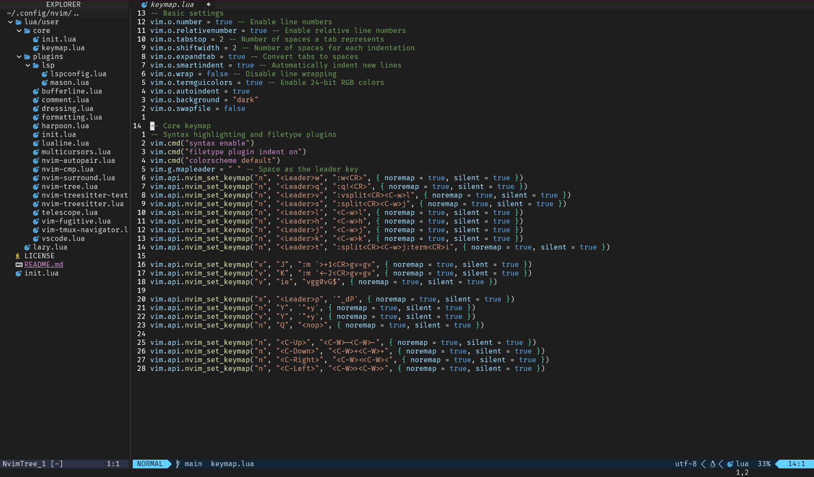

# Getting Started
Install C Compiler (needed for nvim-treesitter)

Setup dependencies:
- fzf
- ripgrep
- fd

## Using pacman:

Using pacman, here are all of the necessary packages for a quick setup with all dependencies required:

```bash
sudo pacman -S dotnet-sdk aspnet-runtime fzf fd ripgrep azure-cli neovim nodejs-lts-iron
```

Then open neovim and let `:Lazy` package manager and `:Mason` install all automatic plugins

## On Ubuntu:
```
sudo apt install build-essential
```

Install the following dependencies:
- Node latest
- Typescript latest
- Dotnet core latest


Install Neovim following the [official instructions](https://github.com/neovim/neovim/blob/master/INSTALL.md)

Make sure you have neovim to your profile path to allow opening it with `nvim`
```
PATH="$PATH:/opt/nvim-linux64/bin"
```
You're all set!

## On Windows:
Install `make` dependencies:
```
winget install ezwinports.make
```

Clone this repo to the following location:
```
~/AppData/Local/nvim
```
After opening for the first time we need to build the libfzf.dll.
Using powershell, navigate to `~/AppData/Local/nvim-data/lazy/telescope-fzf-native.nvim/` and run `make`.

You're all set! You can run this config of neovim on windows. (Note: it runs a bit faster on linux)

## Result:

